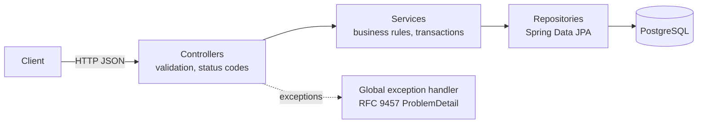

# Inventory Reservation Service


A Kotlin + Spring Boot REST API for multi-store inventory that **prevents overselling** when many customers reserve the same item at the same time, using JPA optimistic locking with bounded retries.

## Tech stack

Kotlin · Spring Boot 4 · Spring Data JPA / Hibernate · PostgreSQL 16 · JUnit 5 · Mockito · Testcontainers · Docker / Docker Compose · GitHub Actions

## Architecture



Layered design: controllers handle HTTP and validation, services hold business rules inside transactions, repositories access PostgreSQL. All errors are returned in the standard RFC 9457 `application/problem+json` format.

## API

| Method | Path | Purpose | Responses |
| --- | --- | --- | --- |
| POST | `/api/stores` | Create a store | 201, 400 |
| GET | `/api/stores` | List stores | 200 |
| POST | `/api/products` | Create a product | 201, 400, 409 duplicate SKU |
| GET | `/api/products/{sku}` | Get a product | 200, 404 |
| PUT | `/api/inventory` | Set stock for a product in a store | 200, 400, 404 |
| GET | `/api/availability/{sku}?pincode=` | Stores with the product in stock | 200, 404 |
| POST | `/api/reservations` | Reserve stock | 201, 400, 404, 409, 422 |

Example:

```bash
curl -X POST http://localhost:8080/api/reservations \
  -H "Content-Type: application/json" \
  -d '{"sku":"TSHIRT-01","storeId":1,"quantity":3}'
```

```json
{"reservationId":1,"sku":"TSHIRT-01","storeId":1,"quantity":3,"remainingStock":7}
```

## How overselling is prevented

Reserving stock is read → check → write. Two concurrent requests can both read `quantity = 1` and both succeed — a **lost update**.

1. **Optimistic locking** — each `inventory` row has a `@Version` column. Hibernate updates with `UPDATE ... WHERE id = ? AND version = ?`; if another transaction committed first, zero rows match and an optimistic-lock exception is raised instead of overwriting.
2. **One transaction per attempt** — `ReservationAttempt.tryReserve()` is `@Transactional` and lives in its own bean, so every call goes through Spring's transactional proxy. The stock decrement and the reservation insert commit or roll back together.
3. **Bounded retry outside the transaction** — `ReservationService` catches the conflict and retries in a *new* transaction with fresh data, up to `inventory.reservation.max-attempts` (default 5), with randomized, growing backoff.
4. **Explicit outcomes** — results are a Kotlin sealed type, mapped exhaustively to `201 Created`, `422 Unprocessable Content` (not enough stock) or `409 Conflict` (retries exhausted).

## Testing

11 automated tests (JUnit 5, Mockito, Testcontainers), run on every push by GitHub Actions:

- **Unit tests (8)** — retry behaviour and reservation rules, with dependencies mocked.
- **Integration tests (3)** — run against a real PostgreSQL 16 container. The concurrency test releases **20 threads simultaneously against 10 units of stock** and asserts exactly 10 reservations succeed, stock ends at 0, the row version increased exactly 10 times, and exactly 10 reservation rows exist.

```bash
./gradlew test      # Docker must be running (Testcontainers)
```

Manual verification: 15 parallel `curl` reservations against 10 units produced 10 × `201` and 5 × `422`; the logs showed 39 optimistic-lock conflicts caught and retried.

## Running locally

**Everything in Docker:**

```bash
./gradlew bootJar
docker compose up --build
```

The API is then available at `http://localhost:8080`. Stop with `docker compose down` (add `-v` to delete the data).

**From the IDE:** start PostgreSQL, then run `InventoryReservationApiApplication`.

```bash
docker run --name inventory-db -e POSTGRES_PASSWORD=pass -e POSTGRES_DB=inventory -p 5433:5432 -d postgres:16
```

Configuration comes from environment variables with local defaults: `DB_URL`, `DB_USER`, `DB_PASSWORD`.

## Design decisions

- **Optimistic over pessimistic locking** — no row locks on reads; suits normal contention. Under extreme contention on one SKU, an atomic conditional `UPDATE ... WHERE quantity >= ?` or pessimistic locking would be preferable.
- **DTOs instead of entities** in the API, so internal fields like `version` never leak.
- **`join fetch` queries** for availability to avoid the N+1 problem.
- **Database constraints** (foreign keys, unique SKU, unique product + store) as the final guarantee of data integrity.
- **Testcontainers instead of H2**, so tests run on the same database engine as development.
- **CI builds and tests the jar once; the Docker image packages that exact artifact** on a slim JRE base, running as a non-root user.

## Problems solved

- **PostgreSQL rejected the connection** with a vague Hibernate "Unable to determine Dialect" error. Root cause: the JVM sent the legacy `Asia/Calcutta` time-zone alias. Fixed by running the service (and its tests) in UTC.
- **A configuration key was silently ignored** because of YAML indentation; a default value in `@Value` hid the mistake. Found while wiring the integration tests.
- **Docker builds failed to download Gradle inside the container** (Java's connections were refused even though `curl` from a container worked). Switched to packaging the jar built and tested by Gradle, so the image build needs no network and ships exactly the tested artifact.
- **CI on Linux needed `gradlew` to be executable** — the executable bit was set explicitly in Git, since Windows doesn't track it.

## Future improvements

Authentication · OpenAPI documentation · Flyway migrations instead of `ddl-auto` · idempotency keys for reservations · pagination · metrics and tracing · event-driven stock updates (e.g. Kafka)

## License

MIT
